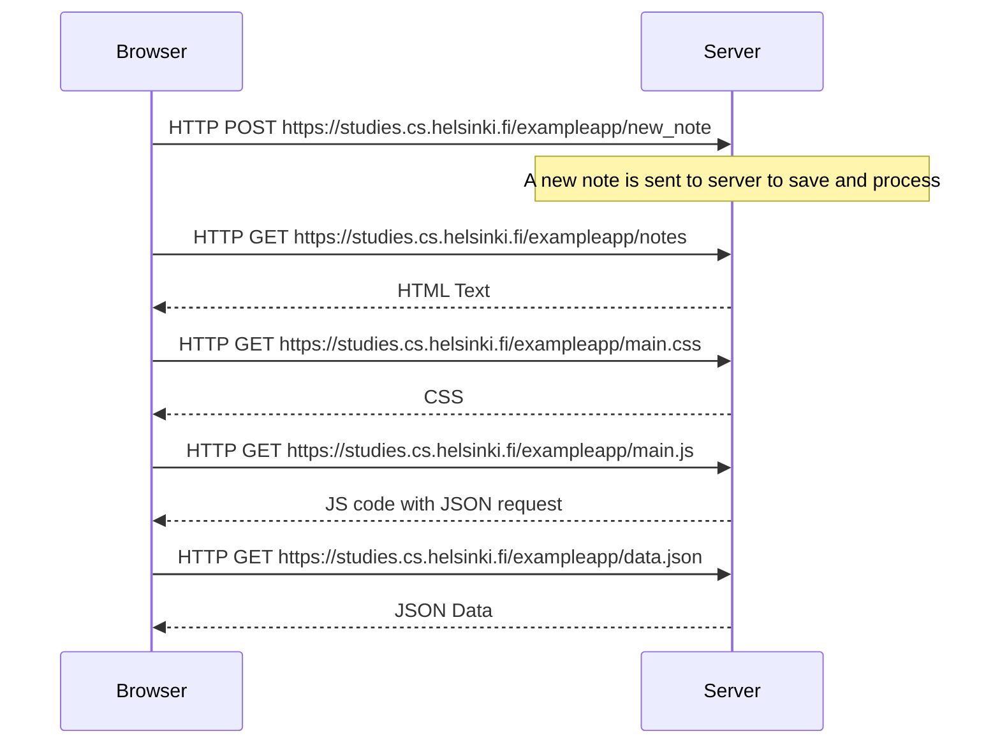

```mermaid
sequenceDiagram

    participant  Browser
    participant  Server

    Browser->>Server: HTTP POST https://studies.cs.helsinki.fi/exampleapp/new_note
     Note over Server: A new note is sent to server to save and process
    Browser->>Server: HTTP GET https://studies.cs.helsinki.fi/exampleapp/notes
    Server-->>Browser: HTML Text
    Browser->>Server: HTTP GET https://studies.cs.helsinki.fi/exampleapp/main.css
    Server-->>Browser: CSS
    Browser->>Server: HTTP GET https://studies.cs.helsinki.fi/exampleapp/main.js
    Server-->>Browser: JS code with JSON request
    Browser->>Server: HTTP GET https://studies.cs.helsinki.fi/exampleapp/data.json
    Server-->>Browser: JSON Data
```
