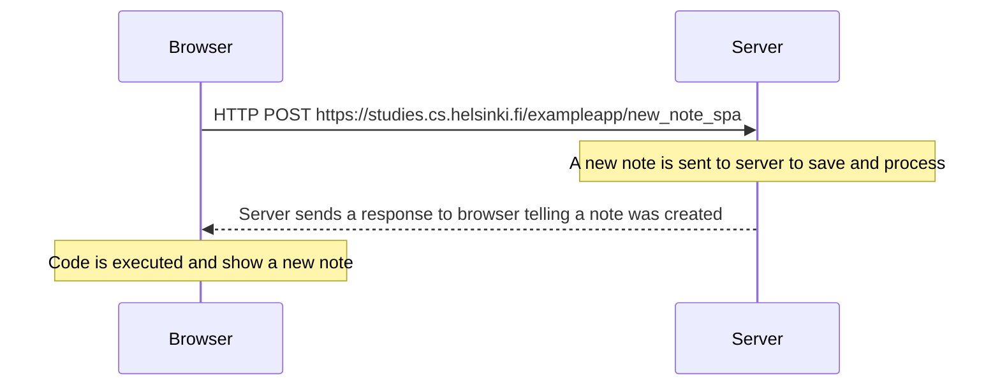

```mermaid
sequenceDiagram

    participant  Browser
    participant  Server

    Browser->>Server: HTTP POST https://studies.cs.helsinki.fi/exampleapp/new_note_spa
    Note over Server: A new note is sent to server to save and process
    Server-->>Browser: Server sends a response to browser telling a note was created
    Note over Browser: Code is executed and show a new note
```
